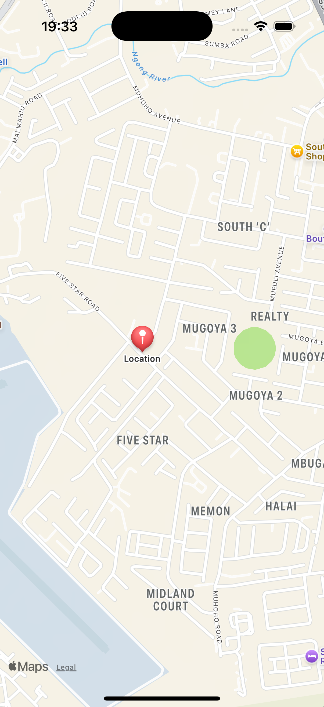

# 🗺️ kmpMaps

**kmpMaps** is a Kotlin Multiplatform (KMP) application that displays a native map view on both **Android** and **iOS** platforms using shared business logic. It demonstrates how to integrate map SDKs in a multiplatform setup.

---

## ✨ Features

- Native map display on both Android and iOS
- Kotlin Multiplatform shared codebase
- Google Maps integration for Android
- Apple Maps integration for iOS

---

## 🚀 Getting Started

### 🔑 API Key

Before running the app, you need to **add your own API key** for map access.

#### 🔧 Android

Update the following line in your `res/values/strings.xml` file:

```xml
<string name="maps_key">YOUR_API_KEY_HERE</string>
```

## Screenshots

 
 

